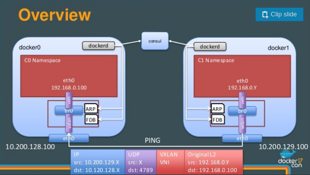

# DevMeetup Container Networking Deep Dive

## Getting started

The below instructions will even work behind a corporate firewall as long as you have access to a corporate proxy server. You only have to set-up the `http_proxy` environment variable, but with IP address and not with DNS names:

    export http_proxy=http://aaa.bbb.ccc.ddd:pppp

If you're not behind a corporate firewall then there is nothing else to do for you.

In order to follow the below examples you will need to install the following (the exact versions should not matter too much):
* [Virtualbox](https://www.virtualbox.org/) (5.2.2)
* [Vagrant](https://www.vagrantup.com/) (2.0.1)
* [ansible](http://docs.ansible.com/) (ansible 2.4.1.0)

As ansible is currently not working on Windows hosts you either need to work on an underlying Linux machine or set-up a separate ansible control VM to execute the ansible scripts.

Virtualbox can be installed via the instructions on the web-site. There are packages for all kinds of package managers available on the download site.

Vagrant I've installed via the [Unofficial deb repository for Vagrant](https://github.com/wolfgang42/vagrant-deb) (here is the repository: [vagrant-deb.linestarve.com](https://vagrant-deb.linestarve.com/)). But you can also install it directly from the web-site.

Ansible will work on any Linux machine that has python installed. While ansible is claiming that it works now with python3 I've found some (few) compatibility issues, but which you can work around. I am using ansible on python3 installed via [anaconda](https://www.anaconda.com/download), so that I do not have to use the `pip` package manager as root. But you can use the default python installation on your machine, too. Installing ansible itself is as easy as:

    > pip install ansible

After that you're ready to go.

### Set-up the 2-node "cluster"

Download or clone this repository from [github](https://github.com/cs224/dev-meetup-container-networking). Then `cd` into this directory.

The first step is to set-up the 2-node "cluster" via Vagrant. Just execute in the current directory where the `Vagrant` file is located the following command:

    vagrant up

If you want to get rid off all of the installed and downloaded software afterwards it is as easy as:

    vagrant destroy -f

The whole process will not do anything to your local machine.

After starting the 2-node cluster try to login. At the top of the Vagrant file you can see a comment with instructions:

    # ssh-add ~/.vagrant.d/insecure_private_key
    # ssh -o UserKnownHostsFile=/dev/null -o StrictHostKeyChecking=no vagrant@192.168.56.101

The first node will get IP address `192.168.56.101` and the second node will get IP address `192.168.56.102`. You will only have to add once the ssh key and afterwards you can login without password. I suggest you login into both nodes before you continue. Sometimes the booting process takes a bit longer and the next steps will fail if the ssh login does not work.

The next step is to install the base system via:

    ansible-playbook 10-setup.yml

This will take some minutes, mostly depending on your speed of your internet connection.

Next you will have to install [consul](https://www.consul.io) and create the docker overlay set-up:

    ansible-playbook 11-consul.yml
    ansible-playbook 12-docker-overlay-setup.yml

Docker in the past required a key value store like `consul` or `etcd` for its overlay network set-up, but in current versions this is not required any longer. This is still supported and we use it to gain some transparency into the data-structures docker uses do manage the network infrastructure in the cluster. We mainly profit from the [consul web ui](https://www.consul.io/intro/getting-started/ui.html) that is part of the `consul` binary itself. Otherwise we could have also used `etcd`

After that you should reboot the cluster:

    vagrant halt
    vagrant up

And after logging in to both nodes check that systemd started without problems:

    systemctl status
    systemctl --failed

Now your cluster is ready for our first experiments.

The set-up created 2 scripts in the `~vagrant` home directory:

* proxy_external.sh
* proxy_local.sh

You can execute:

    source proxy_external.sh

To set the `http_proxy` and other environment variables if you want to use a command line tool that relies on these variables and you're behind a corporate proxy. The script `proxy_local.sh` does the same, but uses the locally installed and running instance of `tinyproxy` that is configured to do local requests locally and remote requests remotely.

## Deep Dive in Docker Overlay Networks

This example is following relatively closely the presentation given by [Laurent Bernaille](https://github.com/lbernail). He also published a 3 part blog post series describing his presentation:

* 2017-05-08: [Deep Dive in Docker Overlay Networks](https://www.youtube.com/watch?v=b3XDl0YsVsg) YouTube presentation by
  * [github](https://github.com/lbernail/dockeroverlays) and [slides](https://www.slideshare.net/lbernail/deep-dive-in-docker-overlay-networks)
  * 2017-04-25: [Part 1](http://techblog.d2-si.eu/2017/04/25/deep-dive-into-docker-overlay-networks-part-1.html)
  * 2017-05-09: [Part 2](http://techblog.d2-si.eu/2017/05/09/deep-dive-into-docker-overlay-networks-part-2.html)
  * 2017-08-20: [Part 3](http://techblog.d2-si.eu/2017/08/20/deep-dive-into-docker-overlay-networks-part-3.html)

I deviate from his presentation where I feel that it makes the whole topic more clear and I mix his approach with approaches from other people. You can find a full list of high value references in the separate [references](./references.md) page.

### Creating the test docker image

In order to test our set-up we'll use a test docker image that you create by typing `make` in the `dev-meetup-container-networking` directory. If you're behind a coporate proxy you need to first execute `source proxy_external.sh` and then execute `make`. This will also create a saved docker image with the file name `net-tools.tar` in the local directory. Have a look in the `./docker-net-tools-image/Dockerfile` to see what the image does. The main purpose is to run an apache httpd that you can talk to on port 80 and the image also comes with several tools that help you to examine the network set-up inside of the container.

#### Import the test docker image in each node instance

In each node of the cluster execute the following:

    docker load -i /vagrant/net-tools.tar

This works, because vagrant is mounting the current directory of the external machine to `/vagrant` and the saved `net-tools.tar` from the previous step is accessible inside of your cluster nodes.

### Monitoring the network stack events

The following steps are not exactly required, but they help you to understand what is going on. I suggest you create a set of 3 root shells (the commands have to be executed as root) on node1 (one node is enough). You can do this as you like, but I also would suggest you try the [tmux](https://gist.github.com/MohamedAlaa/2961058) terminal multiplexer, so that you can see all events at the same time. Execute in each shell the following:

Node1: Shell 1:

    ip monitor link

Node1: Shell 2:

    ip monitor route

Node1: Shell 3:

    echo 1 | sudo tee -a /proc/sys/net/ipv4/neigh/eth0/app_solicit
    ip monitor neigh

### Creating the overlay network

Node1:

    docker network create --driver overlay --internal --subnet 10.13.17.0/24 mynet01

After creating the overlay network try opening the following link in your browser on your host machine: http://192.168.56.101:8500/ui  
This will open up the consule web ui. Navigate to `KEY/VALUE / docker / nodes` and you should see your two docker nodes. Browse a bit around in the consule key/value store to see which data-structures docker creates for such a network.

Executing a `docker network ls` on Node2 should also show you that the network was also created on Node2.

Node2:

    docker network ls

Node1:

    docker inspect mynet01 | jq .

The above command will show you all the meta data about the new network. The monitoring above did not yet show that anything in the network stack of the node was changed. You can verify this via:

    ip -d link
    ifconfig -a

### Run containers on node1 and node2 using the overlay network

Node1:

    docker run -d --rm -h docker1h --name docker1n --ip 10.13.17.7 --net mynet01 net-tools

After this command you should see quite some activity from our monitoring set-up. Many `ip link`s are created and configured. But if you do a `ip -d link` on the node1 you will not be able to see some. We will look into this later.

Node2:

    docker run -it --rm --net mynet01 net-tools /bin/bash
    > ping 10.13.17.7
    > ping docker1n
    > dig docker1n
    > dig @127.0.0.11 docker1n

You should see that the `docker2n` container can ping the `docker1n` container either via direct IP or via DNS name. The group of docker deamons share information about started containers on the relevant networks and they implement a DNS server, which is available to the local nodes. The name used for this DNS server is the name that you gave to the container via the `--name` parameter to the docker deamon.

Node1: second console:

    docker exec -it docker1n /bin/bash

With the above command you enter the running container with a bash shell. You can try a few things in that container:

Node1: second console:

    > ps -xelf # this should show you that process id 1 is the running apache httpd and that you're running a second process with bash in it.
    > ip addr show # should show you that your container has the IP 10.13.17.7 on the interface eth0
    > ip -d link show dev eth0 # should show you that eth0 is a veth device; it should also show you someting like eth0@if11

You should see something like:

    1: lo: <LOOPBACK,UP,LOWER_UP> mtu 65536 qdisc noqueue state UNKNOWN mode DEFAULT group default qlen 1
        link/loopback 00:00:00:00:00:00 brd 00:00:00:00:00:00 promiscuity 0 addrgenmode eui64
    10: eth0@if11: <BROADCAST,MULTICAST,UP,LOWER_UP> mtu 1450 qdisc noqueue state UP mode DEFAULT group default
        link/ether 02:42:0a:0d:11:07 brd ff:ff:ff:ff:ff:ff link-netnsid 0 promiscuity 0
        veth addrgenmode eui64

The part of `eth0@if11` after the `@` sign is interesting. If you exid the docker container by for example executing the `exit` command and then look at the host interfaces:

    ip -d link

You still will not see any further interfaces on the host. What is going on here?

#### Linux kernel namespaces

The key to understanding what is going on is Linux namespaces. The `ip monotor link` command from above showed us a lot of activity in creating and configuring links, but we don't see them on the host. To find out which namespaces your system uses I have found two ways, but am not sure if these two ways will show all namespaces.

The first way is to execute `findmnt --type nsfs`. This will desplay something like:

    vagrant@node1:~$ findmnt --type nsfs
    TARGET                         SOURCE                 FSTYPE OPTIONS
    /run/docker/netns/2-7a424a6adf nsfs[net:[4026532274]] nsfs   rw
    /run/docker/netns/bb1a705f95f4 nsfs[net:[4026532369]] nsfs   rw

The `/run` file system is a tmpfs, e.g. all of these files will disapper after a reboot. Docker mounts these namespaces at the location `/run/docker/netns` and the strange number in brackets is a inode number. We can verify that, via `ls -Li`, which will show inode numbers:

    vagrant@node1:~$ sudo ls -Li /run/docker/netns/bb1a705f95f4
    4026532369 /run/docker/netns/bb1a705f95f4

If you remember the output of docker inspect mynet01 above you will notice that the part after the dash '-' in the first namespace file-name is the network Id:

    docker inspect mynet01 | jq -r '.[0].Id'

This is the namespace that docker creates for the "network", e.g. in our case `mynet01`. If you would run several containers on the same host that all share the same overlay network then they would all share this namespace. This namespace is not attached with a running process.

In addition every docker container itself has a network namespace and you can see it if you know the PID of the container. We can find out the PID via:

    $(docker inspect docker1n | jq -r '.[0].State.Pid')

If you then look at:

    sudo ls -l /proc/$(docker inspect docker1n | jq -r '.[0].State.Pid')/ns

You should see something like:

    vagrant@node1:~$ sudo ls -l /proc/$(docker inspect docker1n | jq -r '.[0].State.Pid')/ns
    total 0
    lrwxrwxrwx 1 root root 0 Dez  2 11:33 cgroup -> cgroup:[4026531835]
    lrwxrwxrwx 1 root root 0 Dez  2 11:16 ipc -> ipc:[4026532366]
    lrwxrwxrwx 1 root root 0 Dez  2 11:16 mnt -> mnt:[4026532364]
    lrwxrwxrwx 1 root root 0 Dez  2 11:15 net -> net:[4026532369]
    lrwxrwxrwx 1 root root 0 Dez  2 11:16 pid -> pid:[4026532367]
    lrwxrwxrwx 1 root root 0 Dez  2 11:33 user -> user:[4026531837]
    lrwxrwxrwx 1 root root 0 Dez  2 11:16 uts -> uts:[4026532365]

Where you see all of the namespaces that this docker container is attached to. You also see the net namespace and its associated inode number 4026532369. This is the inode number that we also saw with the file `/run/docker/netns/bb1a705f95f4` above. There is a quicker way to get to the net namespace associated with a docker container via:

    docker inspect docker1n | jq -r '.[0].NetworkSettings.SandboxKey'
    > /var/run/docker/netns/bb1a705f95f4

This will give you the path to the namespace file that we saw above.

Very new Linux systems have a new command called `lsns`. Ubuntu 16.04 does not have it yet. This command is part of the `util-linux` package and [Karel Zak](http://karelzak.blogspot.de/) maintains a blog about it. He also has a blog post [lsns(8) new command to list Linux namespaces](http://karelzak.blogspot.de/2015/12/lsns8-new-command-to-list-linux.html), which explains its usage. `lsns` only shows you namespaces attached to running processes. It would not show you the namespace `2-7a424a6adf` above, which is not associated with a running process.

#### Entering the network namespace of the container

What does all of this namespace stuff now help us to find out what is going on. The most important command here is `nsenter` and we can use it in several ways, e.g.:

     sudo nsenter -t $(docker inspect docker1n | jq -r '.[0].State.Pid') -n /bin/bash
     sudo nsenter --net=$(docker inspect docker1n | jq -r '.[0].NetworkSettings.SandboxKey') /bin/bash

Both of these commands have the same effect. With the first one you have to give a process id and then the flag `-n` says that you want to enter the net namespace. The following command, e.g. `/bin/bash` is then executed associated with this namespace. With the second command you give a file in the file system that points to a net namespace and the rest works the same.

> With the above two commands you only execute the net namespace, but no other namespace of the container, e.g. the underlying file system is still the host file system. This is also **VERY USEFUL** when you want to debug networking in containers, but the containers do not come packaged with the necessary tooling like `iproute2` or similar.

If you did enter the network namespace of our container and executed for example `ip -d link` you should see the same output as above, e.g. also the `eth0@if11` link.

#### Entering the network namespace of the docker overlay network

Equipped with this namespace knowledge we can now look into the namespace associated with our mynet01 that is not attached to a process:

    sudo nsenter --net=$(findmnt --type nsfs -n --json | jq -r '.filesystems[] | {t: .target}.t' | grep $(id=$(docker inspect mynet01 | jq -r '.[0].Id') echo ${id:0:5})) ip -d link

The above command is a bit long, but most of it is just used to get at the correct filename of the file to identify the namespace. The shorter command would have been in my case:

    sudo nsenter --net=/run/docker/netns/2-7a424a6adf ip -d link

Let's just quickly dissect the above command:

    findmnt --type nsfs -n --json | jq -r '.filesystems[] | {t: .target}.t'

The above gives you the network namespaces mounted in the file system as strings. Let's call this part for the moment $1.

    id=$(docker inspect mynet01 | jq -r '.[0].Id') echo ${id:0:5}

The above gives you the first characters of the network id of the docker network, e.g. `7a4247a424`. Let's call this part for the moment $1.

Finally we do a grep to find the one we are looking for:

    $1 | grep $2

And we use this result in the `nsenter` command.

#### Content of the network namespace of the docker overlay network

On my machine I get:

    1: lo: <LOOPBACK,UP,LOWER_UP> mtu 65536 qdisc noqueue state UNKNOWN mode DEFAULT group default qlen 1
        link/loopback 00:00:00:00:00:00 brd 00:00:00:00:00:00 promiscuity 0 addrgenmode eui64
    2: br0: <BROADCAST,MULTICAST,UP,LOWER_UP> mtu 1450 qdisc noqueue state UP mode DEFAULT group default
        link/ether 1a:57:90:54:51:46 brd ff:ff:ff:ff:ff:ff promiscuity 0
        bridge forward_delay 1500 hello_time 200 max_age 2000 ageing_time 30000 stp_state 0 priority 32768 vlan_filtering 0 vlan_protocol 802.1Q addrgenmode eui64
    9: vxlan0: <BROADCAST,MULTICAST,UP,LOWER_UP> mtu 1450 qdisc noqueue master br0 state UNKNOWN mode DEFAULT group default
        link/ether be:ff:80:f2:38:58 brd ff:ff:ff:ff:ff:ff link-netnsid 0 promiscuity 1
        vxlan id 256 srcport 0 0 dstport 4789 proxy l2miss l3miss ageing 300
        bridge_slave state forwarding priority 32 cost 100 hairpin off guard off root_block off fastleave off learning on flood on addrgenmode eui64
    11: veth0@if10: <BROADCAST,MULTICAST,UP,LOWER_UP> mtu 1450 qdisc noqueue master br0 state UP mode DEFAULT group default
        link/ether 1a:57:90:54:51:46 brd ff:ff:ff:ff:ff:ff link-netnsid 1 promiscuity 1
        veth
        bridge_slave state forwarding priority 32 cost 2 hairpin off guard off root_block off fastleave off learning on flood on addrgenmode eui64
    13: veth1@if12: <BROADCAST,MULTICAST,UP,LOWER_UP> mtu 1450 qdisc noqueue master br0 state UP mode DEFAULT group default
        link/ether e6:33:60:e7:90:7a brd ff:ff:ff:ff:ff:ff link-netnsid 2 promiscuity 1
        veth
        bridge_slave state forwarding priority 32 cost 2 hairpin off guard off root_block off fastleave off learning on flood on addrgenmode eui64

Here is finally the other end of the `veth` pair from above that we saw, `eth0@if11`. It seems that independent of namespaces the linux kernel is linearly enumerating all link devices and the number in front of them identifies them. Here we see `veth0@if10` and above we saw that in the container the link hat the number 10. So this gives us confidence that these two links are the two ends of the `veth pair`.

In addition we see several other things. We see a bridge `br0` link device, to which all `veth` in this namespace are linked to. You can see this if you look at the `11: veth0@if10` line where it says `master br0`.

And then there is a `vxlan0` link that is also attached to the bridge.

    vagrant@node1:~$ sudo nsenter --net=/run/docker/netns/2-7a424a6adf bridge fdb show
    33:33:00:00:00:01 dev br0 self permanent
    01:00:5e:00:00:01 dev br0 self permanent
    be:ff:80:f2:38:58 dev vxlan0 master br0 permanent
    02:42:0a:0d:11:02 dev vxlan0 dst 192.168.56.102 link-netnsid 0 self permanent
    02:42:0a:0d:11:07 dev vxlan0 dst 192.168.56.101 link-netnsid 0 self permanent
    1a:57:90:54:51:46 dev veth0 master br0 permanent
    33:33:00:00:00:01 dev veth0 self permanent
    01:00:5e:00:00:01 dev veth0 self permanent
    e6:33:60:e7:90:7a dev veth1 master br0 permanent
    33:33:00:00:00:01 dev veth1 self permanent
    01:00:5e:00:00:01 dev veth1 self permanent

    vagrant@node1:~$ sudo nsenter --net=/run/docker/netns/2-7a424a6adf ip -d neighbour show
    10.13.17.7 dev vxlan0 lladdr 02:42:0a:0d:11:07 PERMANENT
    10.13.17.2 dev vxlan0 lladdr 02:42:0a:0d:11:02 PERMANENT

This finally leaves us at the following picture that I've taken from the [slides](https://www.slideshare.net/lbernail/deep-dive-in-docker-overlay-networks) from [Laurent Bernaille](https://github.com/lbernail)'s presentation.

