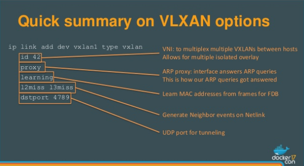

## Docker network the manual way

Let's start two docker containers on Node1 and Node2 without networking:

Node1:

    docker run -d --rm -h docker1h --name docker1n --net=none net-tools

Node2:

    docker run -it --rm -h docker2h --name docker2n --net=none net-tools /bin/bash

Looking at the container network should show something like the following:

    root@docker2h:/# ip -d link
    1: lo: <LOOPBACK,UP,LOWER_UP> mtu 65536 qdisc noqueue state UNKNOWN mode DEFAULT group default
        link/loopback 00:00:00:00:00:00 brd 00:00:00:00:00:00 promiscuity 0

As you can see there is only a local loop-back interface.

As a next step we have to create on both hosts the network namespaces plus the network structure. The script `manual-net-config.sh/010-create-overlay-network.sh` is doing that. Have a look at it and then simply execute it (the same script works for both nodes) on both hosts:

Node1:

    /vagrant/manual-net-config.sh/010-create-overlay-network.sh
    ip netns ls
    sudo ip netns exec overns ip -d link

Node2:

    /vagrant/manual-net-config.sh/010-create-overlay-network.sh
    sudo ip netns exec overns ip -d link

The following picture will explain the vxlan options:

Up to now we did not do anything to the container itself. As a next step we have to attach the container via a `veth` to the network infrastructure we just created. This is done by the script `manual-net-config.sh/020-attach-ctn.sh`. This script takes two parameters, the container name and a single digit number. The script will use this single digit number for the container IP address and the ethernet address for the interface. Have a look at the script then execute:

Node1:

    /vagrant/manual-net-config.sh/020-attach-ctn.sh docker1n 2
    docker exec -it docker1n /bin/bash
    > ip -d link
    > ip -d addr
    > ip -d route

Node2:

    /vagrant/manual-net-config.sh/020-attach-ctn.sh docker2n 3

You can try pinging now, but it still will not work. What is still missing is the configuration for ARP and the forwarding database of the bridge.

Node1:

    /vagrant/manual-net-config.sh/030-populate-arp-fdb.sh 3 192.168.56.102

Node2:

    /vagrant/manual-net-config.sh/030-populate-arp-fdb.sh 2 192.168.56.101

Now ping and curl should work:

Node2:

    root@docker2h:/# ping 10.13.19.2
    PING 10.13.19.2 (10.13.19.2): 56 data bytes
    64 bytes from 10.13.19.2: icmp_seq=0 ttl=64 time=0.666 ms
    64 bytes from 10.13.19.2: icmp_seq=1 ttl=64 time=2.853 ms
    ^C--- 10.13.19.2 ping statistics ---
    2 packets transmitted, 2 packets received, 0% packet loss
    round-trip min/avg/max/stddev = 0.666/1.760/2.853/1.094 ms
    root@docker2h:/# curl 10.13.19.2
    <html>
    <body>
    Hi There - Static page served by Apache Server
    </body>
    </html>
    root@docker2h:/#
